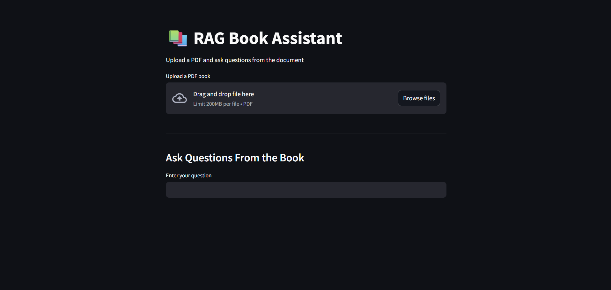
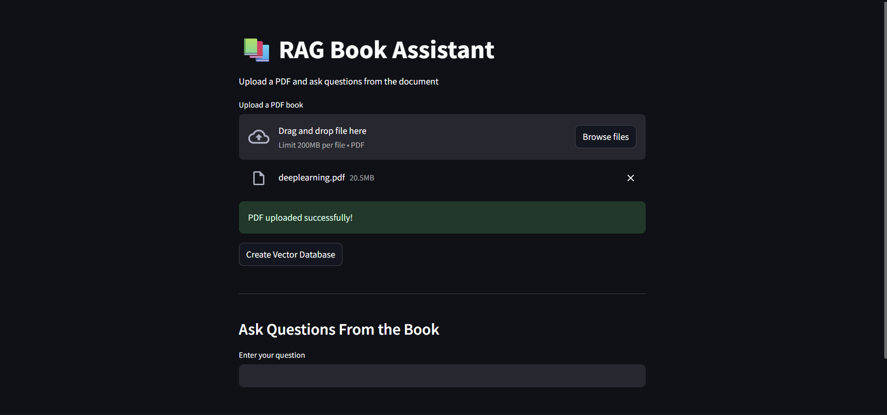
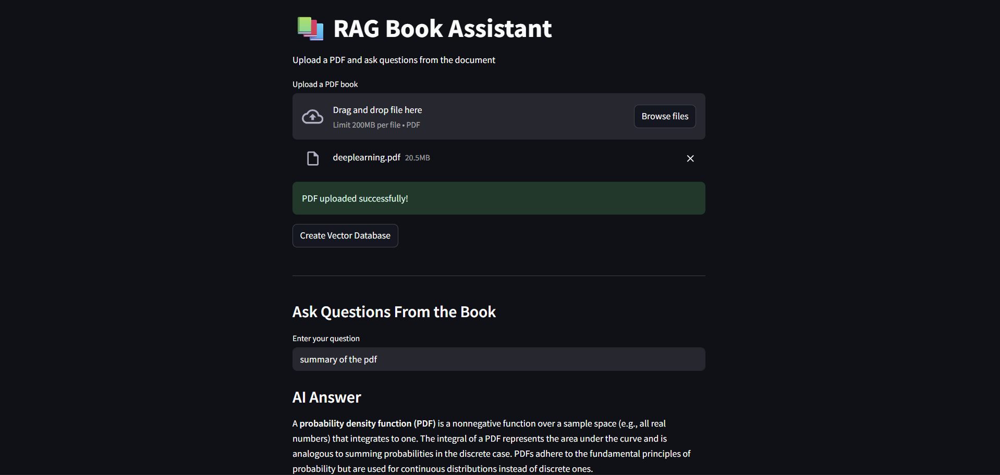
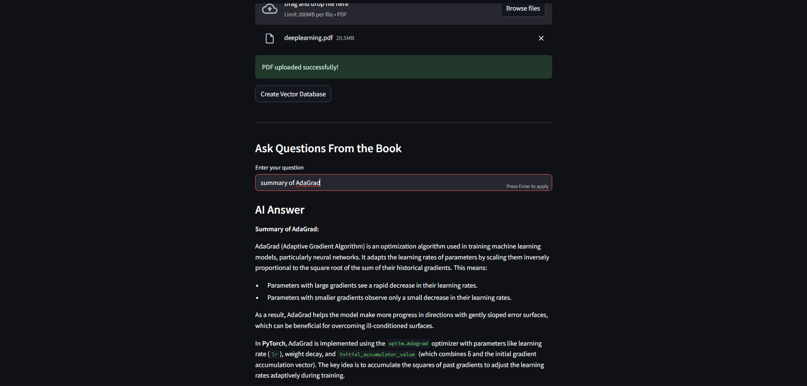
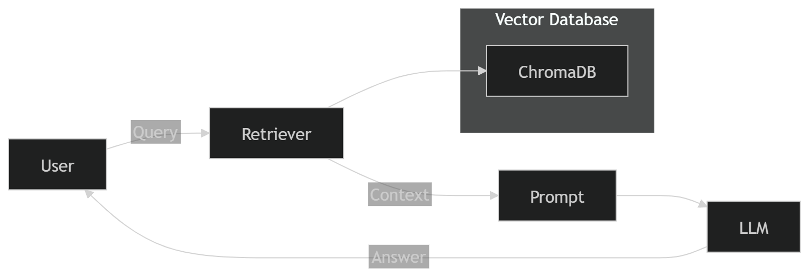

# 📚 RAG Book Assistant

A **Retrieval-Augmented Generation (RAG)** based application that enables users to upload PDF documents and ask context-aware questions using an AI assistant powered by Mistral.

---

## 🚀 Demo

#### 🔹 Upload & Processing

#### 🔹 Ask Question

#### 🔹 Answer

#### 🔹Answer

---

## 🧠 RAG Workflow (Visual)

---

## ✨ Features

🔹 📄 Upload and process PDF documents
🔹 ✂️ Intelligent text chunking
🔹 🧠 Semantic search using embeddings
🔹 📦 Persistent vector database (ChromaDB)
🔹 🤖 AI responses using Mistral LLM
🔹 💬 Streamlit Web UI + CLI chatbot
🔹 ⚡ Efficient retrieval with MMR

---

## 🛠️ Tech Stack

🔹Python
🔹LangChain
🔹ChromaDB
🔹HuggingFace Embeddings
🔹Mistral AI
🔹Streamlit

---

## 📂 Project Structure

    RAG PROJECT/
    │
    ├── chroma_db/
    ├── document loaders/
    │   └── deeplearning.pdf
    │
    ├── retrievers/
    │   ├── arxiv.py
    │   ├── mmr.py
    │   └── multiquery.py
    │
    ├── vector store/
    │   └── DB.py
    │
    ├── Screenshots/
    │   ├── Screenshot1.png
    │    ├── Screenshot2.png
    │  
    ├── app.py
    ├── main.py
    ├── create_database.py
    ├── requirements.txt
    ├── .env
    └── README.md

  ---

  ## ⚙️ Setup Instructions

    1️⃣ Clone the Repository
      git clone https://github.com/your-username/your-repo-name.git
      cd your-repo-name

    2️⃣ Install Dependencies
      pip install -r requirements.txt

    3️⃣ Configure Environment Variables
      MISTRAL_API_KEY=your_api_key_here

    ▶️ Run the Application
      🔹 Streamlit App
        python -m streamlit run app.py
        http://localhost:****

  ---
  
  ## ⭐ Support
  If you like this project, give it a ⭐ on GitHub!

  ---
